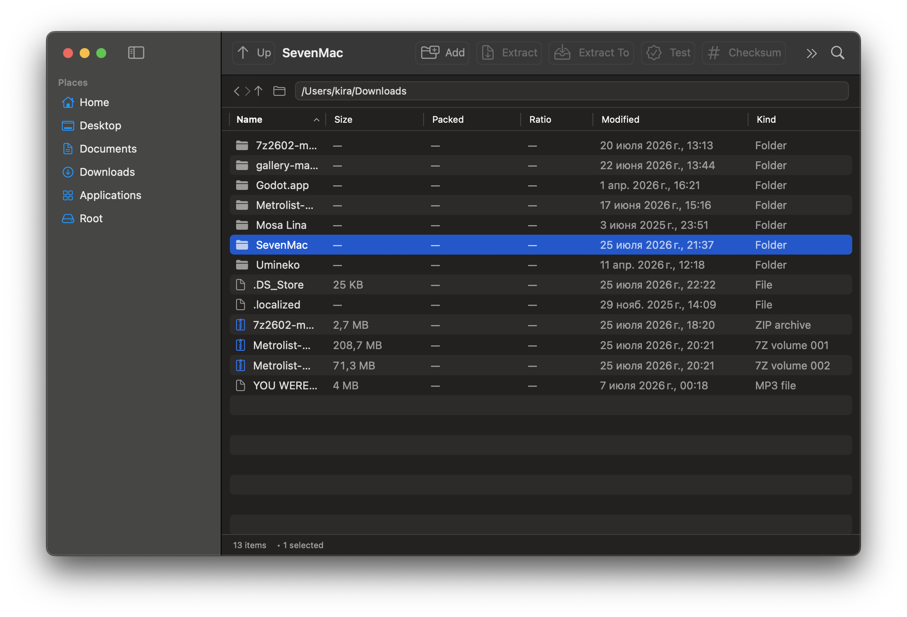
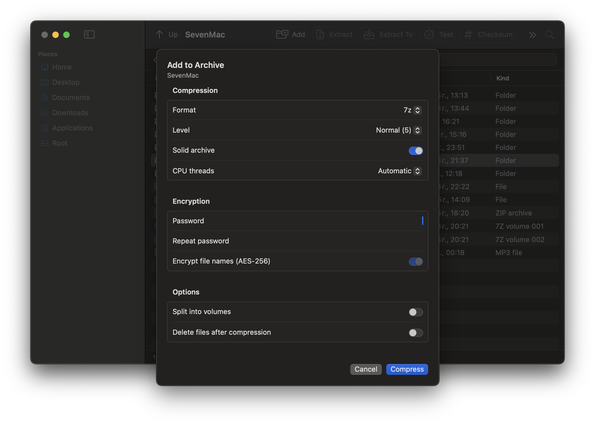
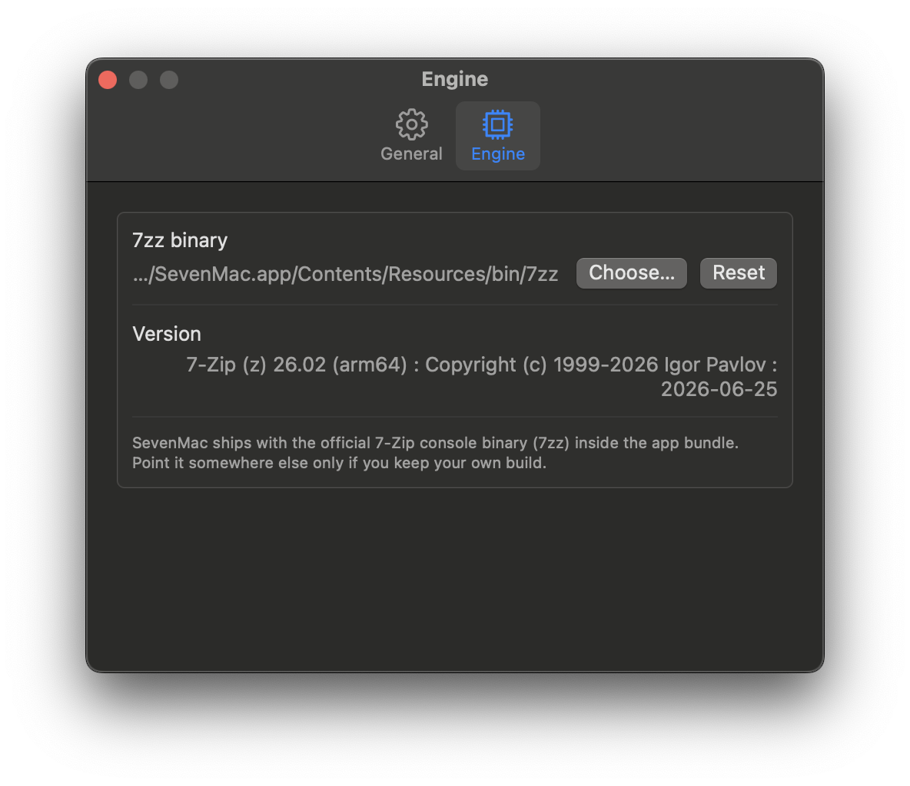

# SevenMac - a real 7-Zip GUI for macOS (Apple Silicon)

<p align="center">
  
</p>

SevenMac is a native SwiftUI file-manager style front end for the official
**7-Zip console engine (`7zz`)**, built for macOS 13+ on Apple Silicon (M1/M2/M3/M4).
It is modelled on the Windows 7-Zip File Manager / NanaZip workflow - browse, open
archives like folders, add, extract, test, checksum, benchmark - instead of the
"drop a file and hope" model most Mac archivers use.

<p align="center">
  
</p>

<p align="center">
  
  
</p>

## New in 1.3

Double-click a file inside an archive to view or edit it. Save UTF-8 text with **Cmd+S**, or use **Replace File** for binary content. ZIP (including APK), 7z and TAR support editing. SevenMac checks the updated archive before saving and keeps a backup next to the original.

Search finds entries across archive folders. Recent archives are in the sidebar; the header shows whether the format is editable. Right-click a file and choose **Open as Archive** to try a container with an unfamiliar extension.

| Container | Browse / extract | Edit / replace |
| --- | --- | --- |
| ZIP, APK, JAR, AAB, APKS, XAPK, IPA, CBZ, WHL, VSIX, Office/OpenDocument ZIP containers | Yes, when recognized by 7zz | Yes |
| 7z, TAR | Yes | Yes |
| RAR/CBR, ISO/DMG, virtual disks, installer containers | When supported by 7zz | Read only |
| Split archives, GZIP/BZIP2/XZ/Zstandard streams | When supported by 7zz | Read only |

The text editor supports UTF-8 files up to 2 MB. This is a container editor: it does not decompile DEX, decode Android binary XML or sign APKs. Modifying signed packages invalidates their signature; see [Android signing tools](https://developer.android.com/tools/apksigner). Documents must retain their own internal schema. Some vendor-specific variants and codecs are not supported by the bundled engine.

## Build and check

On an Apple Silicon Mac with Command Line Tools:

```sh
bash scripts/test.sh
bash scripts/build_app.sh
bash scripts/make_dmg.sh
```

The checks use real temporary archives and the bundled engine; no external test dependencies or full Xcode installation are required. The app build regenerates its icon before packaging.

## Publishing an update

Push or upload the project contents to `main`, including `.github`, `Resources`, `Sources`, `Tests` and `scripts`. GitHub Actions tests the app, builds the DMG and publishes a new release using the version in `Resources/Info.plist` and notes in `docs/releases/v<version>.md`. No personal access token or manual tag is needed. Published versions are left unchanged; increase the version and add matching notes for the next update. You can retry a failed run from the Actions tab. Tag builds remain supported, but the tag must match the app version.

## Why this exists

SevenMac brings the familiar 7-Zip file-manager workflow to macOS in a small, open-source SwiftUI app. Browse archives as folders, inspect package contents, edit files and keep control over compression options.

See the [roadmap](docs/ROADMAP.md) for planned package inspection, archive comparison and Finder integration.

## Features

- **Browse the filesystem and archives in one window.** Double-click an archive
  to step inside it like a folder; nested folders inside the archive are virtualised
  from `7zz l -slt` output.
- **Columns:** name, size, packed size, ratio, modified date, kind. Sortable, filterable.
- **Add to archive** sheet: format (7z/ZIP/TAR/GZIP/BZIP2/XZ/WIM), level Store→Ultra,
  solid mode, thread count, AES-256 password, **encrypt file names** (`-mhe=on`),
  split volumes (`-v100m`), delete source after compression (`-sdel`).
- **Extract** sheet: destination picker, keep/flatten paths (`x` vs `e`),
  overwrite policy (`-aoa/-aos/-aou/-aot`), extract only the selection.
- **Test integrity** (`t`), **remove from archive** (`d`), **checksums** (`h -scrcSHA256`),
  **benchmark** (`b -md=…`) with live output.
- **Live progress** parsed from `-bsp1`, with Cancel (terminates the child process).
- **Encrypted archives**: password prompt on open, header-encrypted archives supported.
  `stdin` is closed so `7zz` can never hang on an invisible prompt.
- Drag & drop onto the window (archive → open, files → compress), Finder reveal,
  full menu bar with shortcuts, Settings for default format/level and engine path.

## Layout

```
SevenMac/
├── Package.swift                  # SwiftPM, macOS 13, executable target
├── Sources/SevenMac/
│   ├── SevenMacApp.swift          # App entry, menu commands
│   ├── Core/
│   │   ├── SevenZBinary.swift     # locate bundled / brew / custom 7zz
│   │   ├── SevenZRunner.swift     # Process wrapper, progress + error mapping
│   │   ├── ArchiveEntry.swift     # `l -slt` parser + archive summary
│   │   ├── ArchiveService.swift   # command-line builders, formats, options
│   │   ├── JobRunner.swift        # one job at a time, publishes progress
│   │   └── AppSettings.swift      # UserDefaults-backed settings, formatters
│   ├── Model/BrowserModel.swift   # navigation, folder + virtual archive tree
│   └── Views/                     # ContentView, Add, Extract, Progress,
│                                  # Password, Info, Benchmark, Settings
├── Resources/
│   ├── Info.plist                 # bundle metadata + archive document types
│   ├── bin/7zz                    # official 7-Zip 26.02 console binary (universal)
│   └── AppIcon.iconset/           # 10 PNGs, ready for iconutil
└── scripts/
    ├── build_app.sh               # swift build + .app assembly + ad-hoc signing
    ├── make_icon.sh               # iconset → AppIcon.icns
    └── dev_run.sh                 # swift run for quick iteration
```

## Installation

1. Download **SevenMac.dmg** from the latest
   [release](../../releases/latest).
2. Open the DMG and drag **SevenMac** into **Applications**.
3. First launch only: right-click the app → **Open** (the build is not
   notarized by Apple, so macOS shows a one-time warning).
